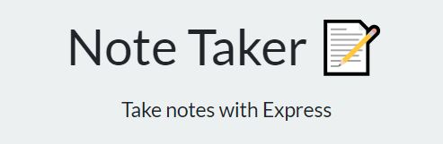

# Have-a-Note
  
 
 
 
  ## Description 
  Ever have a thought, that you were sure you would remember, only to have it drift away moments later. Never again with Have-a-Note! This project relies on an express server instance running on Node.JS and deployed on Heroku. Check out the live version [here]( https://uw-note-taker.herokuapp.com/). With discrete route handling we are able to update data to a sudo, database JSON document based on user inputs.
  
  ## Table of Contents
  * [Installation](#installation)
  * [Usage](#usage)
  * [Credits](#credits)
  * [License](#license)
  * [Contributions](#contributing)
  * [Tests](#tests)
  
  ## Installation 
  Express.js is the only dependency of this project. You will need to NPM install once you have cloned the repo locally. You will also need to install node.js as a runtime as well as have heroku or similar for deployment if launching a live site.
  
  ## Usage
   Frome the live site, click get started. Then you can title and add text to a note. Use the buttons in the top left to save (floppy icon) or start your note over (pencil). Once you have saved a note the data will persit in note-taker until you or another user goes through and delete them from the saved notes que.
  
  ## Credits
  Thanks to trilogy for supplying started front-end code.
  
  ## License
  MIT
  
  ## Contributing
  Not accepting contributions
  
  ## Tests
  none
  
  ## Questions
  Have quesitons about this repo? Please reach out on github or via email
  * [clubkemp](https://github.com/clubkemp)
  * kempj2.jk@gmail.com